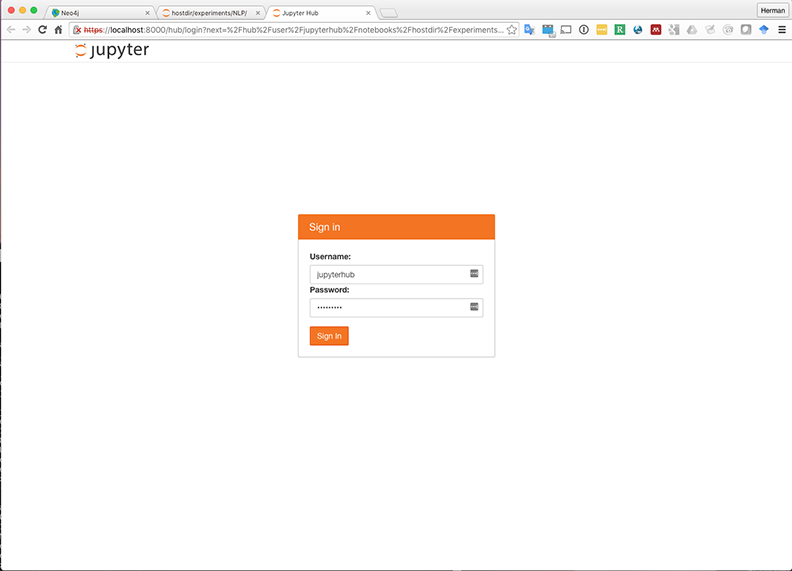

# docker-jupyterhub

Note: This combined JupyterHub and Jupyter Notebook package was built without Anaconda. The base image is Ubuntu Trusty (14.04). Source code to build the container is available at https://github.com/hermantolentino/docker-jupyterhub.

## Pre-requisites

1. Make sure you have Docker installed on your PC, laptop or virtual machine. You can read more about installing Docker here: https://docs.docker.com/engine/installation/.
2. Make sure you read about Jupyter (http://jupyter.org/) and JupyterHub (https://github.com/jupyterhub/jupyterhub).

## Two ways to set up the container

### 1. Pull the image from Docker Hub
This is the base build that runs JupyterHub and Jupyter Notebooks with Python 2.7 and 3.5, R 3.3.0, Ruby 2.2 and Scala 2.11 kernels. Check the "Build Details" link on the Docker page (https://hub.docker.com/r/hermantolentino/docker-jupyterhub/) to see if there is any new base build on queue. To use this base build for building docker images that have additional kernels in this repository do a:

> ```
> $ docker pull hermantolentino/docker-jupyterhub:v5
> ```

This will download the base build which you can use to run Python 2 and 3, R and Scala notebooks. To use this as the base for a new Dockerfile, use the label above in the `FROM:` section of your new Dockerfile. Before "pulling", check the tag for the latest automated build (it may not say 'latest', could be 'v4' or 'v5'), and attach that tag to the label (hermantolentino/docker-jupyterhub:**"TAG HERE"**).

### 2. Build it from the Dockerfile

Follow these steps if you want to build the container from the Dockerfile from scratch on your machine.

1. On the command line: `$ git clone` this repository: https://github.com/hermantolentino/docker-jupyterhub
2. `$ cd docker-jupyterhub`
3. Run this code on the command line: `$ docker build -t hermantolentino/docker-jupyterhub:v5 .` Remember the period - it means use the Dockerfile in the current directory and use that directory as __context__ (this enables you use Docker instructions, like `ADD` or `COPY` that copy files from that directory to your container). This will take a while. Make some coffee.

## Running the container

1. There are two ways to run a container based on this docker image:

 1.1 **Self-contained mode**: Docker container you launch will have no access to any host drive directory.
> ```
> $ docker run -it -p 0.0.0.0:8000:8000 hermantolentino/docker-jupyterhub:v5 supervisord -c /etc/supervisord.conf`
> ```

 This build now has supervisord to launch JupyterHub when running the docker container.

 1.2 **Using current host directory as work directory**:
> ```
> $ docker run -v $(pwd):/home/jupyterhub/hostdir -it -p 0.0.0.0:8000:8000 hermantolentino/jupyterhub:v5 supervisord -c /etc/supervisord.conf
> ```

 `$(pwd)` substitutes your current directory in the command. `-v` creates a shared volume that enables you to access your current host directory (from where you launch the docker container) inside the container.

 1.3 **Using launch script**: You can run launch the container.

 > ```
 > $ ./launch-jupyterhub.sh
 > ```

 Another launch script, launch-jupyterhub-neo4j.sh, launches a neo4j container which can be accesses from jupyter notebooks.

2. This will bring you to the docker container root prompt:
> ```
> root@"DOCKER IMAGE ID":/home/jupyterhub/#
> ```

 In mode 1.1 above when you `cd` to `hostdir`, you will enter a blank directory. In mode 1.2 above, you will find the files present in the current host directory from where you launched the container.

3. Next, load the R and Python data science packages - See "Setting up packages" below. This will take a while again, have some coffee. If there are any errors, please let me know.

4. After loading the packages, you are now ready to launch JupyterHub. At the root prompt type: `# bash startjupyterhub.sh`. This will start your JupyterHub server.

5. Open a browser and type in `https://localhost:8000/`. On the Mac, you may have to substitute "localhost" with the docker machine IP address. The SSL certificates for `https` are self-signed so you will get a browser warning about the site being insecure.



6. Find the username and password for JupyterHub inside the Dockerfile. You can create another user by logging in to the bash prompt of the container and using `# adduser "username"`.

## Setting up packages and run version test notebooks
1. To test if the R, Scala and Python (2.7 and 3.5), Python-PyPy and Ruby kernels load correctly, you need to load and run the kernel notebooks with "Version" in their filenames in the `notebooks` directory from the Jupyter Notebook web interface. Click on each notebook (file name ends with .ipynb) and press the "run code" button. If the kernels are loaded correctly, you will see the version number of the kernel that runs each notebook.

2. To load the R and Python data science packages in the `packages` directory, you need to login to a container bash shell other than the one you ran JupyterHub from. Type ``$ docker exec -it "CONTAINER ID or CONTAINER alias" /bin/bash` to do this.

3. If you want to load packages in batches, run the following scripts one after the other, at the root prompt: `# packages/r-packages.sh`, `# packages/python-packages.sh`, and `# packages/python-nlp-packages.sh`. There may be additional packages that have been added since this document was created. Installing additional packages takes time:

 3.1 **GIS**: Install the Python and R GIS packages. There is an additional Dockerfile called "Dockerfile-otb-apt" to install the Orfeo Toolbox - more about that here: https://www.orfeo-toolbox.org/.

 3.2 **NLP**: Install the Python and R NLP packages. This also installs the NLTK data.

 3.3 **DATABASE CONNECTORS**: There is a package for Python database connectors for Neo4J, MySQL, PostgreSQL and Redis.

 3.4 **NOTEBOOK EXTENSIONS**: Some notebook extensions are also included.

## Installed notebooks

This container has a `notebooks` directory where there are sample notebooks installed and ready to run. Some of the notebooks would require packages that you might have not been installed yet, e.g., the GIS package and you will see an error that says a module is not installed.

## Stopping and starting the container

1. You can stop jupyterhub while inside the container by pressing `^C` twice, this will bring you back to the root prompt.

2. Outside the container, you can do a `$ docker ps` to find out if the container is running. If you have launched your container before  (with a `$ docker run` command), and it does not show up in `$ docker ps`, type `$ docker ps -a` to look up your container. Copy the container id, or the container tag (e.g., insane_ptolemy) and type `$ docker start "CONTAINER TAG or CONTAINER ID"` and then do a `$ docker exec -it "CONTAINER ID OR CONTAINER TAG" "COMMAND"`. "COMMAND" can be "/bin/bash" - this will bring you to a command line bash shell, with a root prompt. You can then type `# bash startjupyterhub.sh` at the command line to start the JupyterHub server.

3. Remember, when you delete the JupyterHub container with `# docker rmi "CONTAINER ID"` all the packages you have installed will be gone. You can do a `# docker commit` before deleting the container instance. Currently loaded and running container instances are listed with `# docker ps`. Both running and stopped instances are listed with `# docker ps -a`.

## Using Dockerfile-packages

`Docker-packages` is the Dockerfile to use to build JupyterHub with R and Python data science packages. Run this Docker container package if you want to build jupyterhub with R and Python data science packages. It is a big container (~4-5GB) and takes a while to build (depends on your machine specs). To build this container, use the `hermantolentino/jupyterhub:v5` host directory as the context but use `Dockerfile-packages` as the Dockerfile specification:

> `
> $ docker build -t hermantolentino/jupyter-packages:v1 -f Dockerfile-packages .`
>

**Warning: This really takes a long time!**

## Notes

Please read the docs to create a secure configuration for your JupyterHub server.

If you want to run JupyterHub and use a folder on your computer that has your notebooks, ` cd ` to that folder and use: `$ docker run -v $(pwd):/home/jupyterhub/hostdir -it -p 0.0.0.0:8000:8000 hermantolentino/jupyterhub:v5 /bin/bash`. This will make your notebook folder visible in the container folder `/home/jupyterhub/hostdir`.
